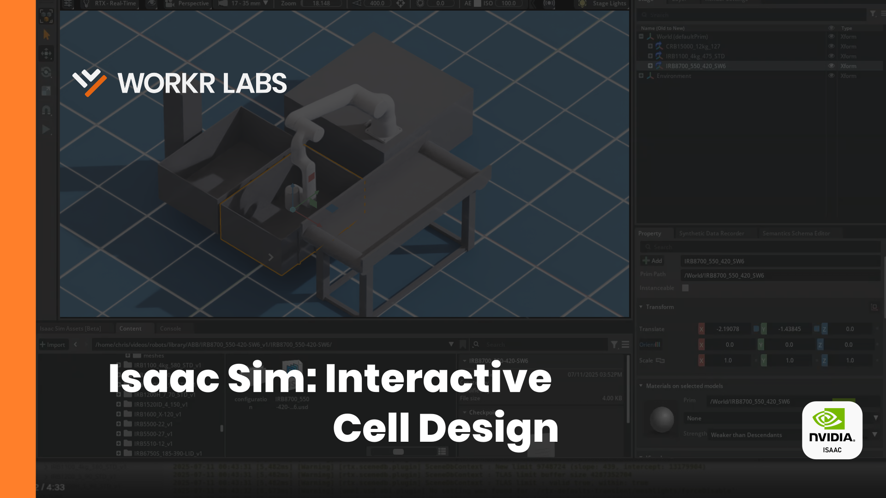

# Interactive Reachability Tool Demo

This repo contains code which demonstrates IsaacSim's interactive abilities. The user can drag crates and conveyor belts around the cell and watch how the robot would reach to it.

## Video Tutorial
Link: https://youtu.be/mPkc4EAjpZU

[](https://youtu.be/mPkc4EAjpZU)

## Quickstart

```bash
# clone this repository (recurse submodules to get robot assets and isaacsim intellisense)
git clone --recurse-submodules https://github.com/work-r-labs/roger-reach.git
cd roger-reach

uv venv
uv pip install -r requirements.txt
```

## Use

```bash
uv run ik_server.py
```

```bash
~/isaacsim/python.sh main.py
```

## Resources

- (Industrial Robot USD & URDF Library) https://github.com/work-r-labs/robots
- (IsaacSim Intellisense) https://github.com/work-r-labs/isaacsim_typings
